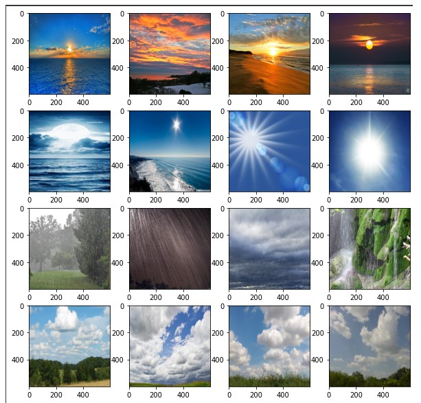
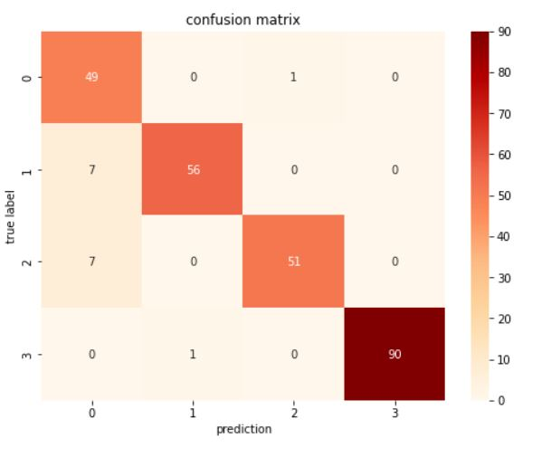
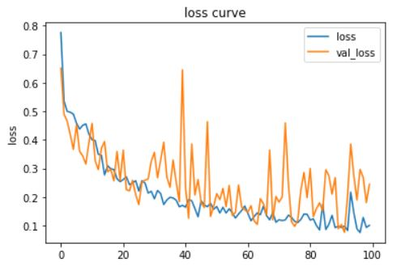
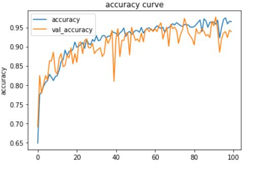

# Weather Classification

## Dataset: weather_image
### training: 1048
### testing: 75
## Object: Cassify the weather from images.
### cloudy: 0
### rain: 1
### shine: 2
### sunrise: 3

## Result
### confusion matrix

### loss curve

### accuracy curve

